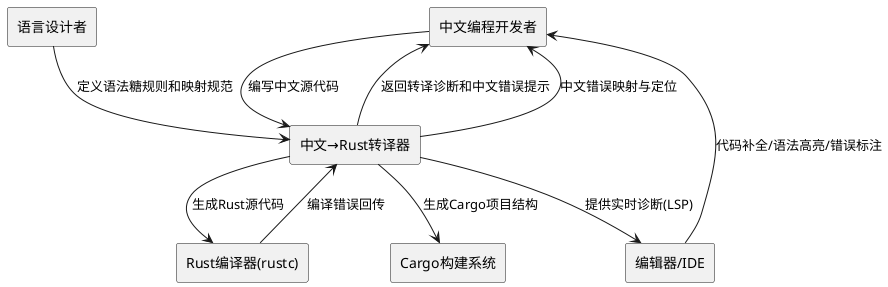
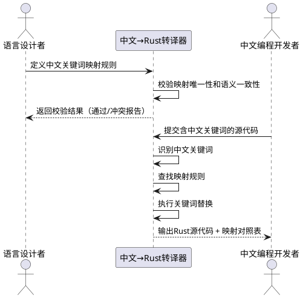
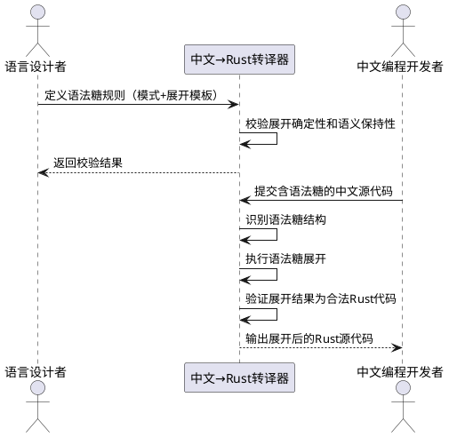
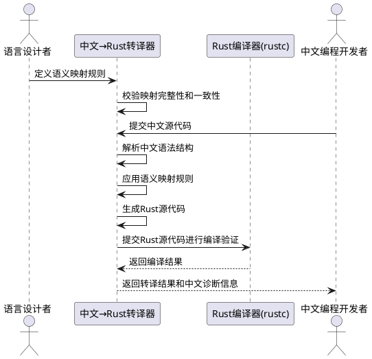
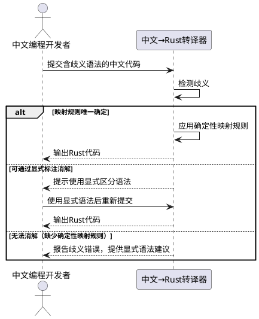
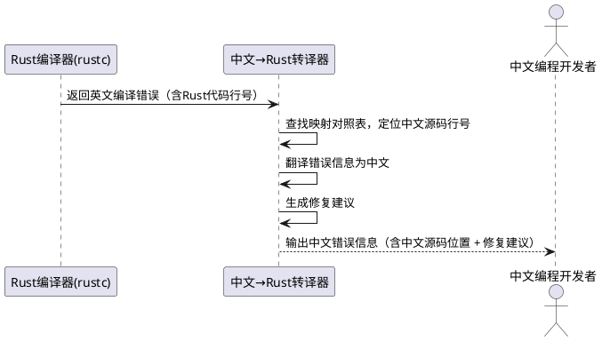
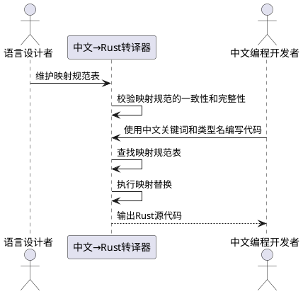

# 中文Rust编程语法设计与Rust转译
本组件负责将中文编程语言的源代码转译为等价的Rust源代码，实现中文语法糖与Rust语义之间的精确映射。

## **1.2 核心输入**
1. **用户编写的中文源代码**：开发者使用中文关键词和语法结构编写的程序文本，来源为编辑器或文件输入
2. **编译配置项**：指定目标Rust版本、输出格式、优化等级等转译参数，来源为配置文件或命令行参数
3. **中文语法扩展定义**：用户或社区自定义的中文语法糖规则，来源为插件或扩展包

## **1.3 核心输出**
1. **等价的Rust源代码**：转译后生成的符合Rust语法和语义规范的源代码文件，目标为Rust编译器
2. **转译诊断信息**：包含中文源代码中的语法错误、语义冲突、映射失败等诊断报告，目标为开发者
3. **映射对照表**：展示中文源代码与生成Rust代码之间的逐行对应关系，目标为开发者调试使用
4. **中文错误提示**：将Rust编译器的英文错误信息翻译为中文并关联到中文源代码位置，目标为开发者

## **1.4 职责边界**
1. 本组件**不负责**Rust代码的编译、链接和执行，这些由Rust工具链（rustc、cargo）完成
2. 本组件**不负责**IDE集成功能（如代码补全、语法高亮），这些由编辑器插件负责
3. 本组件**不负责**中文编程语言的运行时库设计，仅负责语言前端的语法转译
4. 本组件**不负责**对Rust语言本身的扩展或修改，生成的代码必须是标准合法的Rust代码
5. 本组件**不负责**中文自然语言到代码的AI生成，仅处理结构化的中文编程语法

# **2. 领域术语**

**中文关键词**
: 在中文编程语言中用于替代Rust英文关键词的中文保留字，如"函数"对应"fn"、"让"对应"let"。

**语法糖**
: 在中文编程语言中提供的、比Rust原生语法更贴近中文表达习惯的简化语法结构，转译时展开为等价的标准Rust代码。

**语义映射**
: 中文语法结构到Rust语法结构之间的一一对应关系，要求两边在程序行为上完全等价。

**歧义消解**
: 当中文语法结构存在多种可能的Rust映射时，通过确定性映射规则或显式标注确定唯一映射的过程，不依赖任何上下文推断。

**转译**
: 将中文编程语言源代码转换为等价Rust源代码的过程，属于源到源的编译（transpilation）。

**映射对照表**
: 记录中文源代码行号与生成Rust代码行号之间对应关系的数据结构，用于调试和错误定位。

**中文类型名**
: 用中文表达的类型名称，如"整数"对应"i32"、"字符串"对应"String"，需遵循明确的映射规则。

**语法展开**
: 语法糖在转译过程中被替换为等价的标准Rust语法结构的过程，类似于宏展开。

**保留字冲突**
: 中文关键词与中文自然语言词汇产生混淆的情况，需要通过设计规则避免。

**确定性映射规则**
: 预先定义的、不依赖上下文信息的映射规则，确保每个中文语法结构在任何出现位置都映射到唯一确定的Rust语义。

# **3. 角色与边界**

## **3.1 核心角色**
1. **中文编程开发者**：使用中文编程语言编写程序的开发者，需要理解中文关键词和语法糖的含义，通过转译器生成Rust代码
2. **语言设计者**：定义中文关键词、语法糖规则和语义映射规则的人员，负责维护语言规范的一致性

## **3.2 外部系统**
1. **Rust编译器（rustc）**：接收转译器生成的Rust源代码，执行编译、类型检查和代码生成
2. **Cargo构建系统**：管理Rust项目的依赖和构建流程，转译器需生成兼容Cargo项目结构的代码
3. **编辑器/IDE**：提供中文编程的编辑环境，通过LSP等协议与转译器交互以提供实时诊断

## **3.3 交互上下文**

# **4. DFX约束**

## **4.1 性能**
1. 单文件（1000行中文代码）的转译响应时间不得超过2秒
2. 增量转译（仅处理变更部分）的响应时间不得超过500毫秒
3. 转译器内存占用在处理10000行代码时不得超过512MB
4. 语法糖展开不得引入额外的运行时开销，生成的Rust代码性能须与手写Rust代码一致

## **4.2 可靠性**
1. 转译的正确性：中文源代码与生成的Rust代码必须在程序行为上完全等价，等价性通过自动化测试套件验证
2. 系统可用性目标为99.9%，转译器不得因单文件错误而崩溃
3. 转译失败时必须生成完整的诊断信息，包含错误位置、错误原因和修复建议
4. 映射对照表必须保证一致性，不得出现中文代码行与Rust代码行的错误关联

## **4.3 安全性**
1. 转译器不得在生成的Rust代码中引入`unsafe`块，除非中文源代码中显式使用了对应的不安全语法
2. 中文关键词不得被用户代码重定义，保留字保护必须在转译阶段强制执行
3. 转译器不得执行任何网络请求或文件系统写入（输出文件除外）
4. 语法糖展开过程必须是纯函数式的，不得产生副作用

## **4.4 可维护性**
1. 关键词映射规则必须以声明式配置文件存储，支持热加载更新
2. 转译器必须输出结构化日志（JSON格式），包含转译阶段、耗时、映射决策等信息
3. 每个语法糖规则必须附带至少3个测试用例：正常展开、边界情况、错误输入
4. 映射规则变更必须通过版本控制管理，支持规则集的回滚

## **4.5 兼容性**
1. 生成的Rust代码必须兼容Rust 2021 Edition及以上版本
2. 中文关键词映射规则变更时，必须提供迁移工具和迁移指南
3. 转译器必须支持UTF-8编码的中文源代码文件
4. 语法糖规则的增删不得破坏已有中文代码的转译正确性（向后兼容）

# **5. 核心能力**

## **5.1 中文关键词体系设计**

### **5.1.1 业务规则**

1. **一一映射原则**：每个中文关键词必须对应且仅对应一个Rust关键词或语法结构
   a. 验收条件：[给定任意中文关键词] → [转译器输出唯一确定的Rust关键词，不存在多义映射]

2. **语义等价原则**：中文关键词的编程语义必须与对应的Rust关键词完全一致，不得引入语义偏差
   a. 验收条件：[使用中文关键词编写的程序] → [转译后Rust程序的执行结果与手写等价Rust程序完全一致]

3. **可读性优先原则**：中文关键词的选取应当优先考虑中文开发者的直觉理解，选择最贴近编程语义的中文词汇
   a. 验收条件：[中文开发者阅读含中文关键词的代码] → [无需查阅文档即可理解关键词的基本含义]

4. **保留字防冲突原则**：中文关键词不得与中文自然语言中高频使用的虚词（如"的""了""是"等）冲突
   a. 验收条件：[审查关键词列表] → [不包含"的""了""是""在""和"等中文虚词]

5. **关键词长度约束**：中文关键词长度应为1-4个汉字，过短易歧义，过长影响编码效率
   a. 验收条件：[审查关键词列表] → [所有关键词长度在1-4个汉字范围内]

6. **禁止项**：禁止一个中文关键词映射到多个不同Rust关键词，所有映射必须是无歧义的确定性映射
   a. 验收条件：[给定中文关键词"函数"] → [仅映射为"fn"，不得同时映射为"fn"和"function"]

### **5.1.2 交互流程**

### **5.1.3 异常场景**

1. **未定义关键词**
   a. 触发条件：中文源代码中使用了不在映射规则表中的中文词汇作为关键词
   b. 系统行为：转译器停止转译，记录错误位置和未识别的关键词
   c. 用户感知：错误提示"未识别的关键词'某某'，请检查拼写或查阅关键词手册"

2. **保留字冲突**
   a. 触发条件：用户尝试将中文关键词用作变量名或函数名
   b. 系统行为：转译器拒绝转译，标记冲突位置
   c. 用户感知：错误提示"'某某'是保留关键词，不能用作标识符"

3. **编码异常**
   a. 触发条件：源代码文件包含非UTF-8编码的中文字符
   b. 系统行为：转译器停止处理，报告编码错误
   c. 用户感知：错误提示"文件编码异常，请确保使用UTF-8编码保存源代码"

## **5.2 语法糖结构设计**

### **5.2.1 业务规则**

1. **确定性展开原则**：每个语法糖必须具有唯一确定的展开形式，展开结果必须是合法的Rust代码
   a. 验收条件：[给定语法糖结构] → [展开结果唯一且为合法Rust代码]

2. **语义保持原则**：语法糖展开前后程序的语义必须完全等价，不得改变程序行为
   a. 验收条件：[语法糖代码的转译结果] → [与手写展开后的Rust代码执行结果完全一致]

3. **最小惊讶原则**：语法糖的中文表达应当符合中文使用者的语言直觉，避免产生与自然语言理解不一致的语义
   a. 验收条件：[中文开发者阅读语法糖代码] → [对代码行为的预期与实际行为一致]

4. **正交性原则**：不同语法糖之间不得产生交叉影响，每个语法糖应当独立地映射到Rust语法
   a. 验收条件：[同时使用多个语法糖] → [展开结果与各语法糖独立展开后组合的结果一致]

5. **可组合原则**：语法糖应当支持嵌套使用，嵌套展开的结果必须等价于从内到外逐层展开
   a. 验收条件：[嵌套使用语法糖A和B] → [展开结果与先展开B再展开A的结果一致]

6. **禁止项**：禁止设计无法静态确定展开结果的语法糖（即禁止依赖运行时值的语法糖）
   a. 验收条件：[审查所有语法糖规则] → [展开过程仅依赖源代码的静态结构信息]

### **5.2.2 交互流程**

### **5.2.3 异常场景**

1. **语法糖嵌套冲突**
   a. 触发条件：嵌套的语法糖展开顺序影响最终结果（违反正交性）
   b. 系统行为：转译器报告语法糖设计缺陷，拒绝转译
   c. 用户感知：错误提示"语法糖嵌套冲突，请联系语言设计者修复规则"

2. **展开结果非法**
   a. 触发条件：语法糖展开后生成的Rust代码不符合Rust语法规范
   b. 系统行为：转译器标记展开失败位置，记录原始语法糖和展开结果
   c. 用户感知：错误提示"语法糖展开失败，生成的代码不符合Rust语法规范"

3. **语法糖歧义**
   a. 触发条件：同一段中文代码可以匹配多个语法糖规则
   b. 系统行为：转译器应用最长匹配原则消解歧义，若仍无法消解则报告错误
   c. 用户感知：错误提示"语法糖匹配歧义，请使用更明确的语法表达"

## **5.3 中文-Rust语义精确映射**

### **5.3.1 业务规则**

1. **类型系统映射规则**：中文类型名必须与Rust类型建立无歧义的双向映射
   a. 验收条件：[给定中文类型名"整数"] → [映射为唯一Rust类型"i32"]；[给定Rust类型"i32"] → [反向映射为"整数"]

2. **控制流映射规则**：中文控制流语法必须与Rust控制流语法建立结构等价的映射
   a. 验收条件：[中文"如果...则...否则..."] → [映射为"if...{...} else {...}"]，且语义完全等价

3. **模式匹配映射规则**：中文模式匹配语法必须完整覆盖Rust的match表达式语义
   a. 验收条件：[中文"匹配...情况..."] → [映射为"match...{...}"]，所有Rust模式匹配能力均可表达]

4. **所有权与借用映射规则**：中文语法必须能够表达Rust的所有权、借用和生命周期语义
   a. 验收条件：[中文"可变借用"语法] → [映射为"&mut"]；[中文"不可变借用"语法] → [映射为"&"]

5. **生命周期标注映射规则**：中文生命周期标注必须与Rust生命周期标注建立一一映射
   a. 验收条件：[中文生命周期标注"生命周期'a"] → [映射为"'a"]

6. **Trait映射规则**：中文Trait定义和实现语法必须与Rust Trait语法建立完整映射
   a. 验收条件：[中文"特征定义"语法] → [映射为"trait"]；[中文"实现特征"语法] → [映射为"impl Trait for Type"]

7. **泛型映射规则**：中文泛型语法必须完整支持Rust泛型的所有能力，包括泛型函数、泛型结构体、泛型枚举和泛型约束
   a. 验收条件：[中文泛型语法] → [映射为等价的Rust泛型语法，约束条件完整保留]

8. **禁止项**：禁止映射规则引入Rust中不存在的语义概念，所有中文语法必须有对应的Rust语义基础
   a. 验收条件：[审查所有映射规则] → [每条规则的Rust端均为标准Rust语义，无虚构语义]

### **5.3.2 交互流程**

### **5.3.3 异常场景**

1. **映射缺失**
   a. 触发条件：中文语法结构没有对应的Rust映射规则
   b. 系统行为：转译器停止处理，记录缺失映射的语法结构
   c. 用户感知：错误提示"当前语法结构暂不支持转译，请查阅支持特性列表"

2. **类型映射歧义**
   a. 触发条件：中文类型名可映射为多个Rust类型（如"整数"可能对应i8/i16/i32/i64/isize），但开发者未使用显式区分语法
   b. 系统行为：转译器应用确定性映射规则（如"整数"确定性映射为i32），若开发者需要其他类型则必须使用显式语法（如"整数64"）
   c. 用户感知：信息提示"'整数'映射为i32，如需其他整数类型请使用'整数8'/'整数16'/'整数64'等显式指定"

3. **生命周期推断失败**
   a. 触发条件：中文代码中的生命周期关系无法自动推断
   b. 系统行为：转译器要求开发者添加显式生命周期标注
   c. 用户感知：错误提示"生命周期推断失败，请添加显式生命周期标注"

4. **Rust编译失败回传**
   a. 触发条件：转译生成的Rust代码通过了转译器校验但Rust编译器报错
   b. 系统行为：转译器将Rust编译错误映射回中文源代码位置，翻译错误信息为中文
   c. 用户感知：中文错误提示，包含中文源代码位置和中文错误描述

## **5.4 歧义消解机制**

### **5.4.1 业务规则**

1. **最长匹配原则**：当多个映射规则可匹配同一段中文代码时，选择匹配范围最长的规则
   a. 验收条件：[中文代码同时匹配规则A（2字）和规则B（4字）] → [选择规则B的映射结果]

2. **显式优先原则**：开发者可通过语法标注显式指定映射规则，显式标注优先级高于确定性映射规则
   a. 验收条件：[使用显式类型标注"整数64"] → [映射为i64而非默认的i32]

3. **确定性映射原则**：每个中文语法结构必须具有上下文无关的唯一映射，同一中文语法结构在任何出现位置必须映射到同一个Rust语义；若存在多义需求，必须拆分为不同的中文语法结构分别映射
   a. 验收条件：[中文"可变"出现在变量声明上下文] → [映射为"mut"]；[中文"可变引用"出现在引用上下文] → [映射为"&mut"]；[中文"可变"不得因上下文不同而映射为不同Rust语义]

4. **显式消歧原则**：当同一中文词汇存在多种可能的Rust映射时，必须通过不同的中文语法结构显式区分，不得依赖上下文推断；若开发者未使用显式区分语法，转译器必须报告错误
   a. 验收条件：[中文"整数"出现在类型位置] → [映射为i32]；[开发者需要i64] → [必须使用"整数64"显式指定，不得由转译器推断]

5. **禁止项**：禁止在存在未消解歧义的情况下静默选择映射规则
   a. 验收条件：[存在歧义且无消解规则] → [必须报告错误或警告，不得静默选择]

### **5.4.2 交互流程**

### **5.4.3 异常场景**

1. **循环歧义**
   a. 触发条件：多个消解规则形成循环依赖，无法确定优先级
   b. 系统行为：转译器报告消解规则配置错误
   c. 用户感知：错误提示"歧义消解规则冲突，请联系语言设计者修复"

2. **多义词汇未显式区分**
   a. 触发条件：中文词汇存在多种可能的Rust映射，但开发者未使用显式区分语法
   b. 系统行为：转译器拒绝推断，要求开发者使用显式区分语法重新表达
   c. 用户感知：错误提示"词汇'某某'存在多种映射可能，请使用显式语法区分（如'整数64'而非'整数'）"

## **5.5 中文错误信息与诊断**

### **5.5.1 业务规则**

1. **错误信息中文化原则**：所有面向开发者的错误信息、警告和提示必须使用中文表达
   a. 验收条件：[转译过程中产生的任何诊断信息] → [均以中文呈现给开发者]

2. **源码定位原则**：错误信息必须定位到中文源代码的具体行号和列号，而非生成后的Rust代码位置
   a. 验收条件：[Rust编译器报告第X行错误] → [转译器映射回中文源代码第Y行并报告]

3. **错误分类原则**：诊断信息必须按严重程度分为错误（阻止转译）、警告（可继续转译）、提示（信息性）三级
   a. 验收条件：[任意诊断信息] → [必须标注为错误/警告/提示之一]

4. **修复建议原则**：错误和警告信息应当附带可操作的修复建议
   a. 验收条件：[报告语法错误] → [附带至少一条修复建议，如"是否要使用'函数'关键词？"的拼写纠正提示]

5. **禁止项**：禁止向开发者暴露Rust编译器的原始英文错误信息而不做翻译和位置映射
   a. 验收条件：[Rust编译器返回英文错误] → [转译器必须翻译为中文并映射到中文源码位置后再呈现]

### **5.5.2 交互流程**

### **5.5.3 异常场景**

1. **映射对照表缺失**
   a. 触发条件：Rust编译错误指向的Rust代码行在映射对照表中没有对应的中文源码行
   b. 系统行为：转译器报告错误发生在转译器生成的代码区域，无法精确定位到中文源码
   c. 用户感知：警告提示"无法精确定位错误到中文源代码，错误可能由转译器生成的辅助代码引起"

2. **错误信息翻译缺失**
   a. 触发条件：Rust编译器返回的错误类型不在翻译词典中
   b. 系统行为：转译器保留原始英文错误信息，标注为"未翻译"
   c. 用户感知：提示"以下错误信息尚未翻译：[原始英文错误]，请参考Rust官方文档"

## **5.6 中文关键词与语法糖映射规范**

### **5.6.1 业务规则**

1. **基础关键词映射规范**：以下核心关键词映射为强制规范，不得变更
   a. 验收条件：[审查关键词映射表] → [以下映射必须存在且唯一]

   | 中文关键词 | Rust关键词 | 语义说明 |
   |-----------|-----------|---------|
   | 函数 | fn | 函数定义 |
   | 让 | let | 变量绑定 |
   | 可变 | mut | 可变性修饰 |
   | 如果 | if | 条件判断 |
   | 否则 | else | 否则分支 |
   | 匹配 | match | 模式匹配 |
   | 循环 | loop | 无限循环 |
   | 当 | while | 条件循环 |
   | 遍历 | for | 迭代循环 |
   | 在 | in | 迭代范围 |
   | 返回 | return | 函数返回 |
   | 结构体 | struct | 结构体定义 |
   | 枚举 | enum | 枚举定义 |
   | 特征 | trait | 特征定义 |
   | 实现 | impl | 特征/类型实现 |
   | 公开 | pub | 可见性修饰 |
   | 使用 | use | 导入声明 |
   | 模块 | mod | 模块定义 |
   | 自身 | self | 自身引用 |
   | 超集 | super | 父模块引用 |
   | 外部 | extern | 外部链接 |
   | 不安全 | unsafe | 不安全块 |
   | 类型别名 | type | 类型别名 |
   | 其中 | where | 约束子句 |
   | 异步 | async | 异步修饰 |
   | 等待 | await | 异步等待 |
   | 移动 | move | 闭包捕获 |
   | 引用 | ref | 引用绑定 |
   | 静态 | static | 静态项 |
   | 常量 | const | 常量定义 |
   | 真 | true | 布尔真值 |
   | 假 | false | 布尔假值 |
   | 作为 | as | 类型转换 |

2. **类型名映射规范**：以下类型名映射为强制规范
   a. 验收条件：[审查类型映射表] → [以下映射必须存在且唯一]

   | 中文类型名 | Rust类型 | 语义说明 |
   |-----------|---------|---------|
   | 整数 | i32 | 默认有符号整数 |
   | 整数8 | i8 | 8位有符号整数 |
   | 整数16 | i16 | 16位有符号整数 |
   | 整数32 | i32 | 32位有符号整数 |
   | 整数64 | i64 | 64位有符号整数 |
   | 整数尺寸 | isize | 指针大小有符号整数 |
   | 正整数 | u32 | 默认无符号整数 |
   | 正整数8 | u8 | 8位无符号整数 |
   | 正整数16 | u16 | 16位无符号整数 |
   | 正整数32 | u32 | 32位无符号整数 |
   | 正整数64 | u64 | 64位无符号整数 |
   | 正整数尺寸 | usize | 指针大小无符号整数 |
   | 浮点数 | f64 | 默认浮点数 |
   | 浮点数32 | f32 | 32位浮点数 |
   | 浮点数64 | f64 | 64位浮点数 |
   | 布尔 | bool | 布尔类型 |
   | 字符 | char | Unicode字符 |
   | 字符串 | String | 堆分配字符串 |
   | 字符串切片 | &str | 字符串切片 |
   | 元组 | (T1, T2, ...) | 元组类型 |
   | 数组 | [T; N] | 固定大小数组 |
   | 向量 | Vec\<T\> | 动态数组 |
   | 哈希映射 | HashMap\<K, V\> | 哈希映射 |
   | 哈希集合 | HashSet\<T\> | 哈希集合 |
   | 选项 | Option\<T\> | 可选值 |
   | 结果 | Result\<T, E\> | 结果类型 |
   | 无 | () / ! | 空类型/永不返回 |

3. **所有权与借用语法映射规范**：
   a. 验收条件：[审查所有权语法映射] → [以下映射必须存在]

   | 中文语法 | Rust语法 | 语义说明 |
   |---------|---------|---------|
   | 借用 x | &x | 不可变借用 |
   | 可变借用 x | &mut x | 可变借用 |
   | 解引用 x | *x | 解引用操作 |
   | 生命周期'a | 'a | 生命周期标注 |

4. **禁止项**：禁止在映射规范中使用有歧义的中文词汇作为关键词
   a. 验收条件：[审查所有映射规范] → [每个中文关键词在编程上下文中具有唯一确定的语义]

### **5.6.2 交互流程**

### **5.6.3 异常场景**

1. **映射规范版本不一致**
   a. 触发条件：源代码使用的映射规范版本与转译器当前版本不一致
   b. 系统行为：转译器检测版本差异，提示升级或指定版本
   c. 用户感知：警告提示"源代码使用映射规范v1.0，当前转译器支持v1.2，建议更新源代码或指定兼容版本"

2. **自定义映射冲突**
   a. 触发条件：用户自定义的映射规则与内置映射规范冲突
   b. 系统行为：内置映射规范优先级高于自定义映射，转译器报告冲突
   c. 用户感知：错误提示"自定义映射'某某→xxx'与内置映射规范冲突，内置映射优先"

# **6. 数据约束**

## **6.1 关键词映射条目**
1. **中文关键词**：1-4个汉字，必须是UTF-8编码，不得包含标点符号和空格
2. **Rust关键词**：必须是Rust语言规范中定义的合法关键词或语法结构标识符
3. **语义说明**：用一句话描述该映射的编程语义，不超过50字
4. **映射方向**：必须为双向映射（中文→Rust和Rust→中文均可执行）
5. **版本号**：映射条目所属的映射规范版本，格式为"主版本.次版本"

## **6.2 语法糖规则条目**
1. **语法糖名称**：中文描述性名称，2-8个汉字
2. **匹配模式**：定义语法糖的中文语法结构模式，使用EBNF或类似的形式化描述
3. **展开模板**：定义语法糖展开后的Rust代码模板，使用模板变量引用匹配模式中的捕获组
4. **优先级**：整数，数值越大优先级越高，用于消解匹配歧义
5. **展开条件**：可选的约束条件，描述语法糖合法展开的前置条件
6. **状态**：枚举值，取值为"草案"/"实验"/"稳定"/"废弃"，标识规则的成熟度

## **6.3 映射对照表条目**
1. **中文源码行号**：正整数，中文源代码中的行号
2. **中文源码列号**：正整数，中文源代码中关键词/结构的起始列号
3. **Rust代码行号**：正整数，生成Rust代码中对应的行号
4. **Rust代码列号**：正整数，生成Rust代码中对应的起始列号
5. **映射类型**：枚举值，取值为"关键词"/"类型名"/"语法糖"/"控制流"/"其他"
6. **确定性标记**：布尔值，标识该映射是否由确定性映射规则产生，所有合法映射此值必须为真

## **6.4 诊断信息条目**
1. **严重程度**：枚举值，取值为"错误"/"警告"/"提示"
2. **错误码**：格式为"CNxxxx"（xxxx为四位数字），唯一标识错误类型
3. **中文源码位置**：文件路径 + 行号 + 列号
4. **中文错误描述**：用中文描述错误原因，不超过200字
5. **修复建议**：可选，用中文描述修复方法，不超过200字
6. **原始Rust错误**：可选，Rust编译器返回的原始英文错误信息

## **6.5 类型映射条目**
1. **中文类型名**：2-6个汉字，表示类型的中文名称
2. **Rust类型表达式**：合法的Rust类型表达式
3. **是否基础映射**：布尔值，标识该中文类型名是否为对应Rust类型的基础确定性映射（如"整数"→i32为基础映射，"整数64"→i64为显式映射）
4. **泛型参数**：可选，泛型类型的中文名称与Rust泛型参数的对应关系
5. **约束条件**：可选，类型映射的约束说明（如"仅适用于整数类型"）
